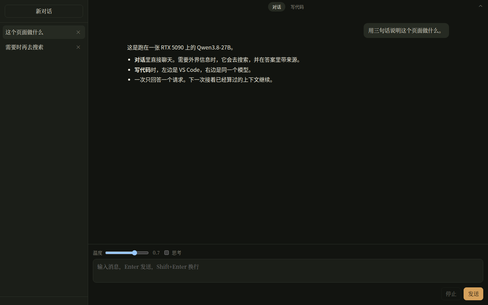
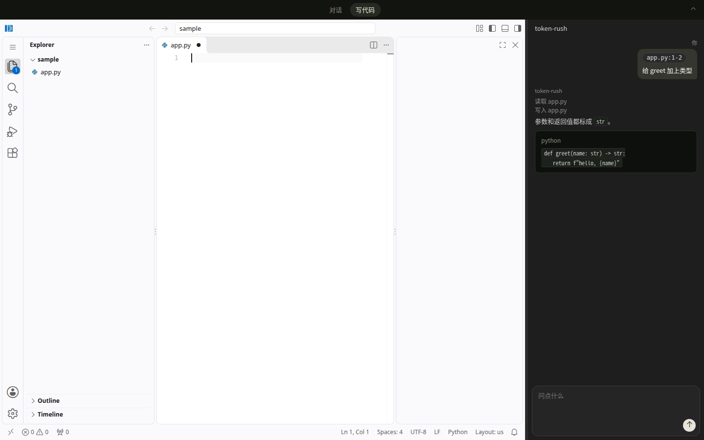

<div align="center">
  <picture>
    <source media="(prefers-color-scheme: dark)" srcset="docs/img/logo_dark.png">
    
  </picture>
  <h1>在一张 RTX 5090 上部署 Qwen3.8-27B</h1>
  <p>浏览器里的聊天机器人，和带对话的代码编辑器。一次一个用户。底下是 Token Rush，给这个模型和这张卡写的推理引擎。</p>
</div>

打开一个页面，顶部在「对话」和「写代码」之间切换。生成始终是这一条流：权重留在这张 5090 上，一段对话的前缀留在显存里，下一句只计算新增的 token。

<p>
  
</p>
<p>
  
</p>

## 对话

左侧是对话列表，右侧是流式回复。记录写在 `~/.local/share/tokenrush/chats.json`，刷新之后还在。思考默认关着，页面上可以打开，思考和正文分开显示。同一时间只有一个请求，第二个排队。

**连网。** 权重里没有今天的新闻。问到需要外界信息的事时，模型调用 `web_search`，服务去查，需要正文时再调用 `web_fetch` 打开结果页，然后根据查到的文字写答案，并带上这次返回的来源。查询只发这一句，不把整段聊天交给搜索引擎。启动前设置 `SEARXNG_URL`（自建 SearXNG，请求 `{url}/search?q=&format=json`）或 `BRAVE_API_KEY`。两个都没设时，这一轮会告诉模型没有配置搜索。一轮最多 8 次这类调用。搜索发生在两次解码之间，不进 CUDA graph。

**记忆。** 同一段对话里，前面说过的话都在：浏览器每次把整段再发上去，显存里对得上的前缀留着，只计算新增的 token。换一段新对话时，不带上其它对话，模型也不会自己去翻旧记录。只有当你问起以前某段说过什么，它才调用 `recall`，在 `chats.json` 里按词查找。摘录和当前这段冲突时，以当前这段为准，并注明旧记录里的不同说法。一段对话超过窗口一半时，更早的回合收成摘要再继续，文件里仍是全文。

## 写代码

点「写代码」之后，左边是浏览器里的 VS Code（[code-server](https://github.com/coder/code-server)），右边是同一个模型的对话。编辑器打开哪个目录，对话就只动那个目录：可以列出目录、读文件、改文件。编辑器自己负责文件树、搜索、Git 界面和终端。这边不做 Tab 补全，不加载第二份权重，也不做语言服务或调试器。

**Git。** 提交、看状态、推送由模型调用 `git` 完成，在打开的目录里执行，参数是 `git` 后面的那一串，例如 `["status"]`、`["add", "app.py"]`、`["commit", "-m", "说明"]`。页面上每次调用显示成一行，例如 `git status`。允许的是日常子命令：`status`、`diff`、`log`、`add`、`commit`、`push`、`pull`、`branch`、`checkout` 等。工作目录固定在打开的文件夹；`-C`、`--git-dir`、`clone`、改全局配置都会拒绝。同一条命令刚跑过就不会再跑一遍，避免停在重复调用上。

**选中加入对话。** 在编辑器里选中代码，右键「把选中代码加入 token-rush」；在终端里选中输出，右键「把选中输出加入 token-rush」。选区出现在输入框上方，代码显示成 `文件:行号`（多行是 `文件:起-止`），终端显示成 `shell: 终端名`。发送时这段文字连同你写的问题一起交给模型。两条命令来自 `extensions/tokenrush-chat`，装上并重新加载窗口之后才有。

## 部署

一张 RTX 5090，CUDA 13 的驱动，以及 [`uv`](https://docs.astral.sh/uv/)。在仓库根目录：

```bash
uv run python -m tokenrush.serve --port 8000
```

第一次运行会把正文权重（17 GB）和 DFlash2 草稿（3.9 GB）下到 Hugging Face 缓存。终端打印页面地址之后再打开浏览器，冷启动要加载权重并捕获 CUDA graph。默认地址是 `http://127.0.0.1:8000/`。

默认上下文是 256k，两份草稿一起大约 30 GB。这张卡上还有别的程序时，把窗口收小：

```bash
uv run python -m tokenrush.serve --max-len 32768 --port 8000
```

写代码需要 [code-server](https://github.com/coder/code-server) 4.141 或更新版本，只听环回地址。页面把 `/vscode/` 转到 `TOKENRUSH_VSCODE_UPSTREAM`，默认是 `http://127.0.0.1:8088`。

```bash
code-server \
  --bind-addr 127.0.0.1:8088 --auth none \
  --disable-telemetry --disable-update-check --disable-workspace-trust \
  /path/to/the/project
```

在 VS Code 或 Cursor 的集成终端里启动时，先执行 `unset VSCODE_IPC_HOOK_CLI`，否则 code-server 会立刻退出。换端口时，`--bind-addr` 和 `TOKENRUSH_VSCODE_UPSTREAM` 写成同一个地址。

选中代码或终端输出后的两条右键命令来自 `extensions/tokenrush-chat`。复制进 code-server 的扩展目录，再在编辑器里执行 **Developer: Reload Window**：

```bash
ext="${XDG_DATA_HOME:-$HOME/.local/share}/code-server/extensions/tokenrush.chat-0.0.1"
mkdir -p "$(dirname "$ext")"
cp -a extensions/tokenrush-chat "$ext"
```

扩展默认把选区 `POST` 到 `http://127.0.0.1:8000/ide/cite`。服务改用 HTTPS 时，启动 code-server 之前设置 `TOKENRUSH_ORIGIN` 为同一个源。自签证书的环回连接是允许的。

终端里粘贴依赖浏览器剪贴板，剪贴板只在 HTTPS 页面里可用。证书和私钥一起给出时，页面走 HTTPS：

```bash
uv run python -m tokenrush.serve --port 8000 \
  --tls-cert /path/to/cert.pem --tls-key /path/to/key.pem
```

同一时间只有一个浏览器占用页面。第二个要输入 `tokenrush/serve.py` 里的 `_SEAT_PASSWORD` 才能进入，进入后会挤掉前一个。放到别人能打开的地址之前，先改这个密码。

同一端口也说 OpenAI Chat Completions 和 Anthropic Messages。Claude Code 把地址指过来即可，工具在它自己的进程里执行，生成仍是这一条流：

```bash
ANTHROPIC_BASE_URL=http://127.0.0.1:8000 ANTHROPIC_AUTH_TOKEN=anything claude
```

协议、座位和长对话怎么压实，见 [docs/serving.md](docs/serving.md)、[docs/chatbot.md](docs/chatbot.md)、[docs/memory.md](docs/memory.md)、[docs/web-search.md](docs/web-search.md)。

## 底层：Token Rush

上面这一页没有自己的推理。`tokenrush.serve` 把引擎留在显存里，页面只是它的一个客户端。

Token Rush 只做一件事：让 **Qwen3.8-27B 的文本路径在一张 RTX 5090 上、一次一条请求** 时出字尽量快。通用服务引擎按并发吞吐来设计，连续批调度、分页 KV、动态形状、多进程 API 在一条流上是纯开销。这里换成连续预分配的 KV、进程内执行，以及把整步 decode 录进一张 CUDA graph。48 层 Gated DeltaNet 的循环状态不随上下文变长，只有 16 层注意力为长度付钱。视觉塔丢掉，不服务。

一张卡、同一天、同一批 prompt 上测到的速度（短上下文，贪心，tok/s）：

| 引擎及其最快配置 | 散文 | 代码 | 数学 |
|---|---|---|---|
| **Token Rush**（DFlash2 草稿，在图里） | **229** | **358** | **379** |
| SGLang + DSpark | 106 | 138 | 207 |
| ExLlamaV3 + MTP ×2 | 132 | 142 | 166 |
| ollama（默认 MTP） | 129 | 135 | 166 |
| llama.cpp + MTP | 124 | 115 | 160 |
| vLLM（原始 decode；它自己的投机更慢） | 78 | 78 | 78 |

<picture>
  <source media="(prefers-color-scheme: dark)" srcset="docs/img/decode_vs_context_dark.svg">
  
</picture>

200k 上下文时，带投机的散文仍然在每秒 200–220 token，不带投机约 70；下一家大约 60。256k 窗口放得下，也能用：262k 处的 needle 能取回，峰值约 26 GB。

速度主要来自三处。整步 CUDA graph 去掉了 48 层小算子的启动开销。投机解码在 batch size 为 1 时几乎白送：张量核本来空着，验 7 个草稿大约只比解码 1 个 token 多 13% 的时间。kernel 按这张卡的实测读带宽 1701 GB/s 来写。权重是 4.25 bit 的 int4（group 128，GPTQ 加 MSE），正文 14.3 GB 量级；相对 bf16 的平均 KL 是 0.023，还没有到 ExLlamaV3 的 0.013。

数字、对手配方和逐步记录在 [docs/baselines.md](docs/baselines.md)、[docs/progress.md](docs/progress.md)、[docs/quantization.md](docs/quantization.md)。引擎在解决什么问题，见 [docs/overview.md](docs/overview.md)。

常用开关：`--draft auto` 在中文 prompt 上改用模型自带的 MTP head，其它用 DFlash2；`--draft raw` 关掉投机；`--max-len` 是上下文窗口。

## 不做的事

- 一次一条请求。没有连续批、没有分页 KV、没有为了吞吐做的调度。
- 一个模型、一张卡、只有文本。Qwen3.8-27B 的文本路径，`sm_120`。
- 写代码时不做 Tab 补全，不实现 `/v1/responses`，不把 code-server 或扩展的配置提交进仓库。

## 目录

| | |
|---|---|
| `tokenrush/` | 引擎和服务。`model.py` 是文本路径，`fused.py` / `ops.py` 是 Triton kernel，`csrc/` 是 Marlin，`spec.py` / `mtp.py` / `dflash.py` 是投机，`serve.py` 是页面和 API，`web/index.html` 是聊天和写代码那一页 |
| `bench/` | 速度、质量和 needle |
| `tests/` | 协议和差分测试。`pytest tests/`；kernel 测试需要这张卡 |
| `docs/` | 部署之后的行为、基线、量化和逐步记录。阅读顺序在 [docs/overview.md](docs/overview.md#阅读顺序) |
| `results/` | 上面那张表所依据的原始日志 |

## 致谢

推理引擎 [Token Rush](https://github.com/zyhector/token-rush) 是 [Hector Zhu](https://www.linkedin.com/in/hectorzhu/) 的开源项目。本仓库在它上面做聊天页面和代码编辑器，权重用的是他发布的 [`zyhector/Qwen3.8-27B-TokenRush-int4g128`](https://huggingface.co/zyhector/Qwen3.8-27B-TokenRush-int4g128)。
