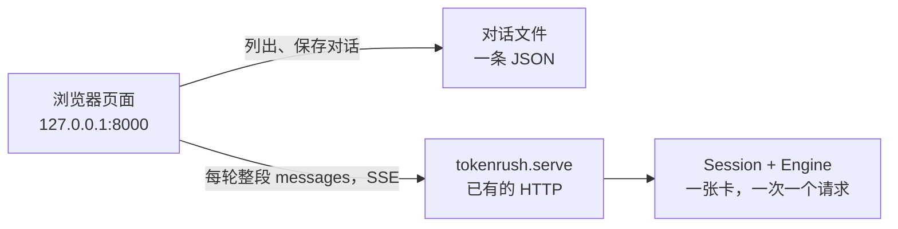

# 本机网页聊天：架构

一个用户，浏览器打开本机页面，背后是这张卡上的 Qwen3.8-27B。推理不另写。`python -m tokenrush.serve` 把引擎留在显存里，并在同一个进程提供页面和 OpenAI Chat Completions。网页是这个接口的一个客户端。协议细节在 [serving.md](serving.md)，本机怎么把服务跑起来在 [demo.md](demo.md)。

权重不在本机时，启动会下载进 Hub 缓存（正文 17 GB，DFlash2 草稿 3.9 GB）。已经在缓存里就直接加载。页面地址是 `http://127.0.0.1:8000/`，对话写在 `~/.local/share/tokenrush/chats.json`。

```bash
cd /home/jesse/workspace/token-rush
DFLASH="$HOME/.cache/tokenrush/Qwen3.8-27B-DFlash2"
args=(--max-len 32768 --host 127.0.0.1 --port 8000)
if [[ -f "$DFLASH/config.json" ]]; then args+=(--dflash-path "$DFLASH"); fi
uv run python -m tokenrush.serve "${args[@]}"
```

卡是空的、要 256k 窗口时去掉 `--max-len 32768`。冷启动要加载权重并捕获 CUDA graph，终端打印 `chat page http://127.0.0.1:8000/` 之后再打开浏览器。

## 不做什么

- 不做第二个推理进程，不把权重再加载一份。
- 不做账号、多用户、公网。页面和接口只听 `127.0.0.1`。
- 页面不上传图片。连网搜索在这一轮里由服务执行，见 [web-search.md](web-search.md)。新对话不带入其它对话；用户问起过去某段时才查，冲突以本段为准，见 [memory.md](memory.md)。
- 不在页面里复现 CUDA graph、草稿或量化。那些留在引擎里。

## 四层



| 层 | 放什么 | 不放什么 |
|---|---|---|
| 页面 | 消息列表、输入框、流式文字、新对话、停止 | 权重、token id、KV |
| 对话文件 | 每段对话的标题和 `messages` | 生成中的半句话。写盘发生在这一轮结束之后 |
| HTTP | 现成的 `POST /v1/chat/completions`；另外三个很小的读写路由 | 调度、批处理 |
| 引擎 | 当前这一次请求的 KV、卷积环、递推状态 | 多段对话的历史。历史在文件里，是文本 |

页面和接口由同一个进程提供，这样浏览器同源，不必处理跨域。冷启动仍然是加载权重和捕获 CUDA graph，大约几十秒。页面在这之前打不开；服务打印就绪之后再访问。

## 一轮对话怎么走

用户在同一段对话里接着说时，浏览器把这段对话的全部消息重新发上去，而不是只发新的一句。这是现成 `Session` 的用法：它比对新 prompt 和显存里已经算过的 token，最长的公共前缀留着，只 prefill 多出来的部分。工具回合测过：427 token 的前缀后面加 20 个 token，端到端 0.07 秒。

```text
浏览器                serve                         GPU
  |  POST messages     |                              |
  |  stream: true      |-- 渲染 chat template ------->|
  |                    |-- 前缀能对上就从那里续 ----->|
  |<-- SSE 一个个 token |<-- 投机解码，提交接受的前缀 --|
  |  用户按停止         |-- 客户端断开，下一步取消 ---->|
  |  这一轮结束后写盘   |                              |
```

中文 prompt 在 `--draft auto` 下走 MTP，其它走 DFlash2。贪心时两条路的最终 token 相同，差别是速度。服务默认温度 0.7、top-p 0.9；页面要固定成这套，并在请求里写明 `temperature` 和 `top_p`，避免和某次启动参数不一致。

Thinking 默认关。页面上一个开关，打开时请求带 `chat_template_kwargs.enable_thinking: true`。思考内容从响应的 `reasoning_content` 读，和正文分开显示。

停止就是浏览器中止这次 fetch。服务在下一步解码时取消，显存状态停在已经提交的 token 上，不会停在半个 kernel 里。

同一时间只有一个请求在跑。页面在生成时禁用发送。如果仍有第二个请求发出去，它在服务里排队，不会并行占卡。

## 对话存在哪

显存里只有**上一次请求**留下来的状态。换一段对话、或改了前面某一句，新 prompt 对不上那个前缀，下一句就从头 prefill。第一版接受这件事：换对话时第一句会慢，慢的是 prefill，不是页面逻辑。

文本历史放在本机一个 JSON 文件里，例如 `~/.local/share/tokenrush/chats.json`。一个用户、一个浏览器，用文件而不是账号。刷新页面从文件读回来。

文件里每一段对话：

| 字段 | 含义 |
|---|---|
| `id` | 本地生成的 id |
| `title` | 第一句用户话的前几个字，可以改 |
| `created` | 创建时间 |
| `messages` | `{role, content}`。搜过的一轮还会留下助手的 `tool_calls` 和 `role: tool` 的结果 |

三个路由就够，都只动这个文件：

| 方法 | 路径 | 作用 |
|---|---|---|
| `GET` | `/chats` | 列出 id、标题、时间 |
| `GET` | `/chats/{id}` | 取出完整 messages |
| `PUT` | `/chats/{id}` | 整段覆盖保存。删除用 `PUT` 一个空列表，或单独的 `DELETE` |

生成本身不走这些路由。生成永远是：

`POST /v1/chat/completions`，body 里 `model` 随便写（服务不校验名字）、`stream: true`、`messages` 为这一段的全部消息。流式格式是 OpenAI 的 SSE：`data: {"choices":[{"delta":{"content":"..."}}]}`，结束是 `data: [DONE]`。

可选的系统提示存在该对话的第一条 `system` 消息里，随 `messages` 一起发送。页面自己不设隐藏提示；连网那一轮服务会补上搜索说明，见 [web-search.md](web-search.md)。

## 上下文和显存

服务默认 `--max-len 262144`，两份草稿一起大约 30 GB。这台机器上如果还有别的程序占着卡，聊天用 32k：

启动命令在文首。`--max-len 32768` 是这台机器上旁边可能还有别的程序时用的窗口。

页面不负责裁剪 token。消息总长超过窗口时，服务返回 400。第一版在发出前用一个粗估：中英混合大约 2 个字符一个 token，超过 `--max-len` 的八成就在输入框旁提示，而不是悄悄删掉旧消息。真要截断时再定规则，现在先让用户自己开新对话。同一段接着聊时，前缀对得上就只 prefill 新增的 token；超过一半窗口时服务把更早的回合收成摘要，规则在 [memory.md](memory.md)。

## 页面上有什么

一页就够，静态文件由同一个进程在 `GET /` 返回。

- 左侧：对话列表。新对话、点选、删除。
- 右侧：消息。用户和助手分开。生成中的助手消息逐字接上。
- 底部：输入框、发送、停止。生成时发送变灰。
- 一处设置：温度、thinking 开关。存在浏览器里，不进对话文件。

不做成安装包，不引入前端构建。一个 HTML 文件加少量脚本，向同源的 `/v1/chat/completions` 和 `/chats` 发请求。

## 和现有代码的边界

| 已有，直接用 | 要加 |
|---|---|
| `tokenrush/serve.py` 的 Chat Completions、流式、取消、排队 | `GET /` 返回页面 |
| `tokenrush/session.py` 的前缀复用 | `/chats` 三个读写 |
| `tokenrush/chat.py` 的模板和 thinking 解析 | `tokenrush/web/index.html` |
| `--host 127.0.0.1` | 对话 JSON 的路径，启动时打印一行 |

`tests/test_serve.py` 不占 GPU。新路由的测试放在同一处：写一个临时目录里的 JSON，检查列出、覆盖、删除，不加载模型。
