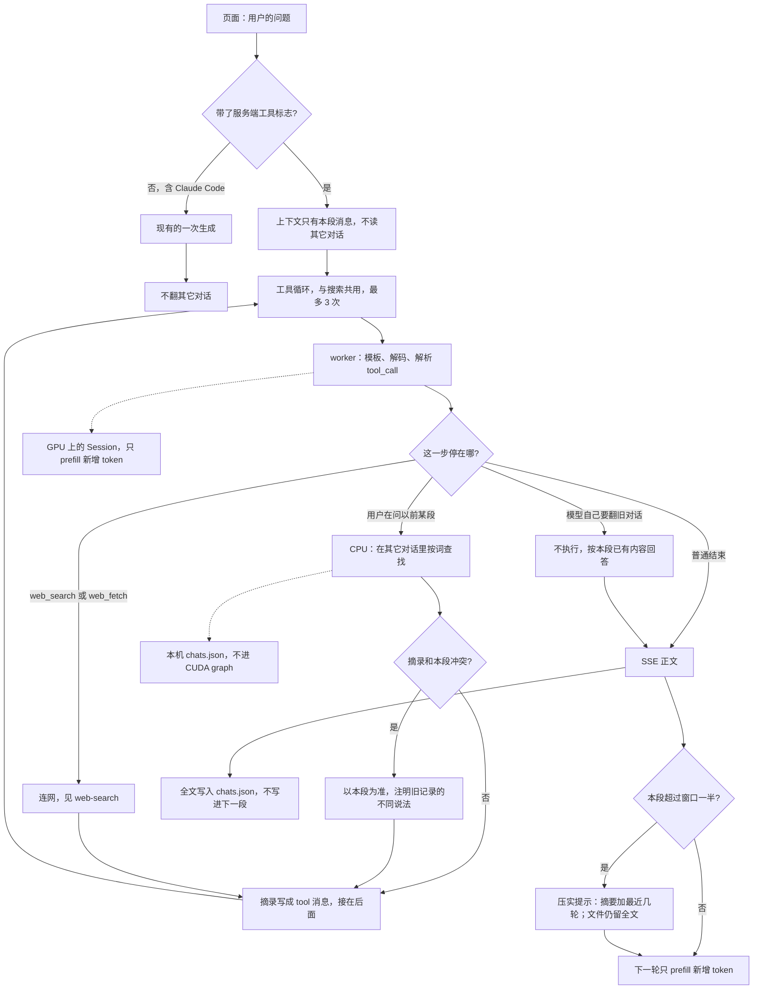

# 跨对话记忆：方案

同一段对话里，前面聊过的话已经在。每一轮浏览器把这段的全部消息再发给模型，前缀对得上时只 prefill 新增的 token，所以问「我上一句说了什么」它看得到。换一段新对话时，请求里只有这几句，模型看不到 `chats.json` 里的其它记录。这一版就保持这样。

新对话不受老对话影响。其它对话的全文、摘要、置顶事实都不放进这段的系统消息，模型也不主动去翻它们。用户这句话明确在问以前某段说过什么时，才允许 `recall`。摘录和本段已经说过的内容冲突时，以本段为准，并注明旧记录里的不同说法。

这和连网一样，不改权重。Cursor 的一次 chat、Claude Code 的一次会话都是这个范围：换一段就是一段新的上下文。ChatGPT 那种「每段新对话都带着以前的事实」这里不做。

## 一轮里发生什么



带标志的请求也只看见本段。生成在 GPU 上。只有用户在问过去某段时，才在 CPU 上读 `chats.json`。不带标志的请求同样不翻其它对话。

```text
新对话的第一句
    |
    |-- 只有这段自己的消息，没有旧对话的摘要
    |-- 用户的问题
    v
用户没问过去     模型直接回答
用户问「上次说的学习率」
    |
    |-- 在其它对话里按词查找，返回日期、标题、原句
    |-- 若和本段已经说过的内容冲突，回答以本段为准
    v
模型说明是哪一段，以及本段有没有改口
```

`recall` 走 [web-search.md](web-search.md) 里同一个服务端工具循环，和 `web_search` 共用次数上限。查找先做关键词。一个用户的对话规模用不上向量库。

## 记在哪

只有已经在用的 `~/.local/share/tokenrush/chats.json`：每段对话的全文，每轮结束时写入。不另建一份会跟进下一段的 `memory.json`，也不做 `remember`。旧对话留在文件里，供用户点开那一段，或在本段明确问起时被 `recall` 摘一句。

## 本段为准

服务不在网页请求前拼「你记得这些事实」或「最近的对话」。新对话的提示词就是这段自己的消息，加上连网那一轮的搜索说明。

`recall` 的工具说明里写明两条：

- 只在用户询问以前某段对话的内容时调用。
- 摘录与本段用户已经说过的话冲突时，按本段回答，并写出旧记录里的不同说法。不要用旧记录改正本段。

当前这段的全文仍然整段重发。窗口装不下时，服务返回 400。同一段里变长、变慢，按下一节处理。新开的那段不接上一段的摘要。

## 同一段对话不要越来越慢

接着聊同一段时，浏览器仍把全文发上来。`Session` 已经做了前缀复用：新 prompt 和显存里的 token 从开头逐个比对，对得上的部分留着，只 prefill 多出来的后缀。427 个 token 后面加 20 个，端到端 0.07 秒；12 万后面加几个，0.44 秒。对不上就从头 prefill。`session.py` 里写过：10 万 token 重算一次大约一分钟。所以「越来越慢」不是全文重发本身，而是前缀被拆掉，或者单轮要读的缓存变长。

拆前缀的典型动作是改已经发出去的前半段。系统消息插在最前面，记忆每轮重写一遍（新事实、摘要重排、搜索说明时有时无），后面每一个 token 的位置都变了，这一轮就把整段历史重算一遍。对话越长，这一下越贵，总工作量随轮数平方增长。温度、top-p、思考开关若改变模板渲染出的前缀，效果相同。

解码变慢是另一笔，小得多。64 层里只有 16 层注意力带着随长度增长的 KV，FP8 下大约 32 KB/token；另外 48 层是定长的递推状态。权重约 16 GB。32k 的 KV 大约 1 GB，解码比短上下文慢几个百分点。200k 时 KV 到 6.4 GB，原始解码的天花板从大约 126 tok/s 降到 86。这是带宽，前缀复用消不掉。

各家把「长对话还快」做成下面几件事。按这个顺序做，前两件就够用在 32k 的网页上。

| 做法 | 谁在用 | 这里怎么用 |
|---|---|---|
| 前缀一旦写上就不再改 | Anthropic、OpenAI 的 prompt cache；vLLM 的自动前缀缓存。缓存能命中，是因为前缀的 token 逐字节相同 | 已经有，在 `Session`。本段进行中不往开头插入旧对话。搜索说明从第一轮就在，并且保持不变 |
| 对话压实 | Claude 和 Claude Code 的 compaction：接近窗口时把更早的回合收成一段摘要，留下最近几轮原文。ChatGPT 同一思路 | 本段超过窗口的一半（32k 上约 16k）时，用驻留的模型写一段摘要。交给模型的提示变成：开头那份不变的系统消息、这段摘要、最近几轮原文。聊天文件仍留全文，页面照常显示原文，不提示窗口也不标出被收起的句子。这一下前缀会断一次，只 prefill 压实后的短提示，之后又是只补后缀 |
| 清掉旧的工具结果 | Anthropic 的 context editing：旧的工具输出占掉大量 token，回答写完后不再整段留在提示里 | 跟压实一起做，避免单独再断一次前缀。搜过、抓过的页面在提示里收成一行（查询和 URL）。文件里的 `tool` 消息保持原文，页面上的链接还在 |
| 丢掉一部分 KV | StreamingLLM 的 attention sink、H2O、SnapKV、Quest：少读一些缓存行，让解码带宽不随长度涨 | 32k 上 KV 只有约 1 GB，旁边是 16 GB 权重，这步省不下可见的时间。不做。单段要在 10 万 token 上停很久时再单独立项 |

压实产生的摘要只留在本段里，作为一条服务插入的说明，跟进问题仍能引用它。它不进入下一段。`recall` 从文件里的全文找原句，不从这段摘要里找。

## 已经接上

1. 新对话的提示词不包含其它对话。没有跨对话的系统消息。搜索说明从第一轮就在，并且保持不变。
2. `recall(query)` 在 `tokenrush/recall.py`。用户没问以前的对话时不打开聊天文件。查到的片段带日期和标题，不含当前这段。数字对不上时，工具结果写明以本段为准。
3. 超过一半窗口时，服务写一段摘要，之后的请求沿用这份摘要，直到压实后的提示自己又超过一半。交给模型的旧工具结果收成一行。聊天文件仍是全文，页面不提这件事。

`recall` 的结果留在这段对话里，跟进时不用再搜一遍。`tool` 角色和助手的 `tool_calls` 已经能写入对话文件，和搜索用的是同一种消息。

## 怎么算做完

不占 GPU。准备一段写好的旧对话，其中学习率是 `1e-4`。新对话的第一轮提示词里没有这句，也没有旧对话的标题。用户在新对话里先说「学习率用 `3e-4`」，再问「上次说的学习率是多少」：桩调用 `recall`，假执行返回 `1e-4`，第二轮回答采用 `3e-4`，并提到旧记录是 `1e-4`。用户只说「继续写代码」、桩仍发出 `recall` 时，服务不查文件。不带服务端标志的请求也不查。

另测前缀：同一段的第二次请求，系统消息与第一次逐字相同，桩上看到的 token 前缀能接上。压实之后，交给模型的消息变短，且仍含摘要和最近一轮；聊天文件里的原句还在。
