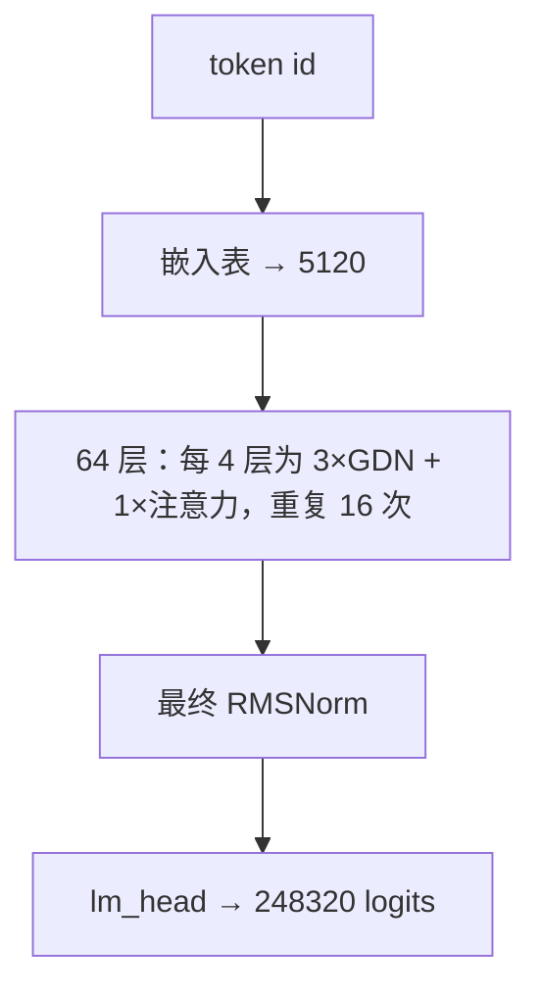
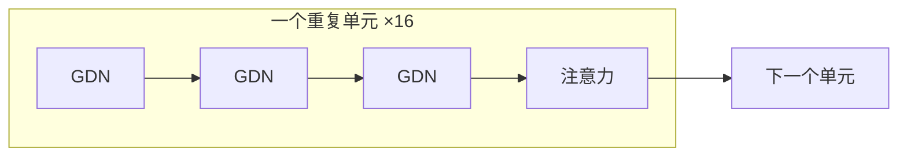
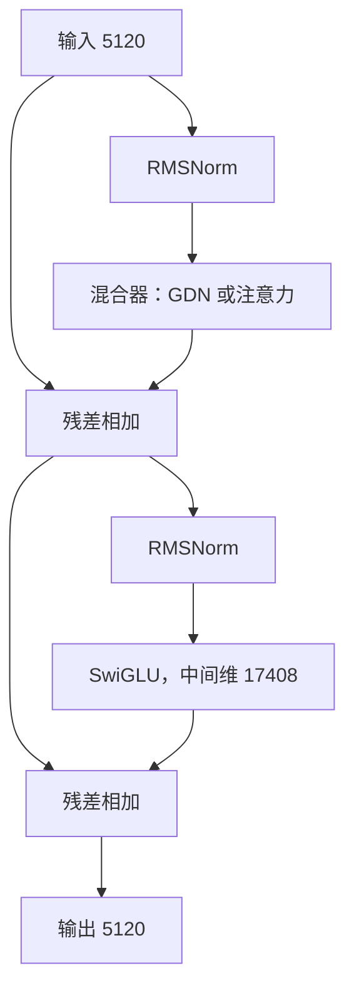
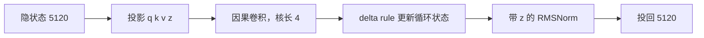
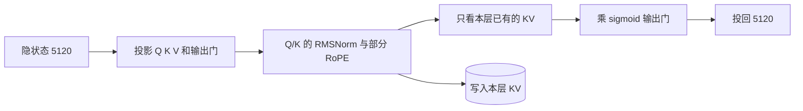
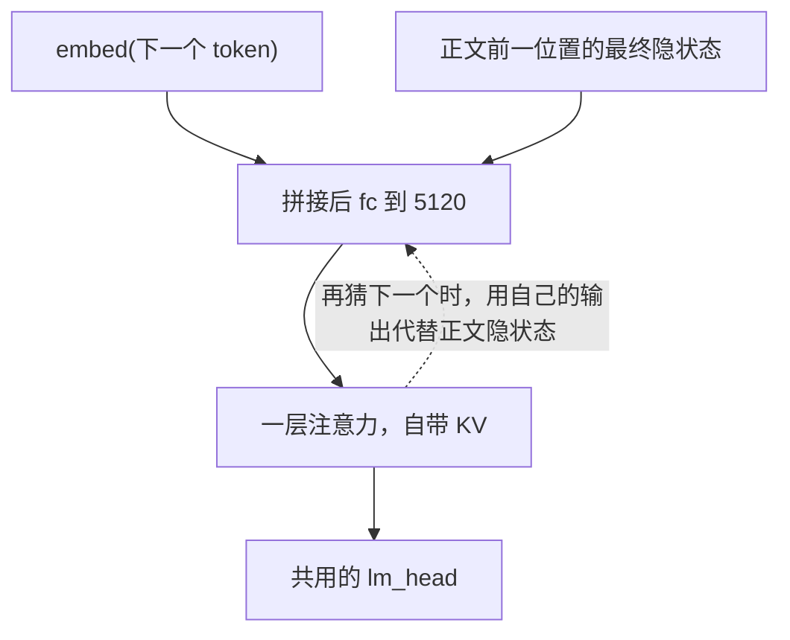

# Qwen3.8-27B 的结构

公开权重是 [Qwen/Qwen3.8-27B](https://huggingface.co/Qwen/Qwen3.8-27B)。仓库里一共 27.78B 参数、bf16 大约 55.6 GB，按张量名前缀分成四块，彼此不是同一条网络：

| 前缀 | 是什么 | 参数 |
|---|---|---|
| `model.language_model.*` | 文本主干，64 层 | 25.63B |
| `lm_head` | 把最后一层隐状态投到词表 | 1.27B |
| `mtp.*` | 多 token 预测头，投机解码的一条草稿 | 0.425B |
| `model.visual.*` | 视觉塔，只处理图像 | 0.461B |

Token Rush 服务的文本路径是前两行，**26.90B**。`mtp.*` 在开投机解码、并且走 MTP 草稿时才加载。`model.visual.*` 按前缀丢掉。层的形状从 checkpoint 的 `config.json` 里 `text_config` 读出，代码在 `tokenrush/config.py` 和 `tokenrush/model.py`。

## 文本路径怎么走



一个 token 的 id 先查嵌入表，得到长度 5120 的向量，然后过 64 层，每层都是：

1. RMSNorm，再进这一层的混合器（GDN 或注意力）。
2. 加回残差。
3. 再 RMSNorm，进 SwiGLU 前馈（中间维 17408：`silu(gate) * up`，再投回 5120）。
4. 再加回残差。

64 层之后还有一次 RMSNorm，然后 `lm_head` 得到词表上的 logits。词表大小 248320。原生最大位置是 262144（通常写成 256k）。

64 层不是同一种。配置里 `full_attention_interval` 为 4：每 4 层里 3 层是 Gated DeltaNet（配置名 `linear_attention`），1 层是带输出门的注意力（`full_attention`）。所以全模型是 **48 层 GDN + 16 层注意力**。只有这 16 层注意力写出 KV cache，长度随上下文涨；48 层 GDN 的循环状态大小固定，和上下文无关。



一层内部，不管混合器是哪一种，外壳相同：



## Gated DeltaNet 层



混合器把输入投成 q、k、v 和一门控 z，q/k/v 先过一个核长为 4 的因果卷积（卷积状态是一小段环，不随上下文变长），再做 delta rule 更新。循环状态按每个 value head 存一块，大小与已经生成了多少 token 无关。更新完做带 z 的 RMSNorm，再投回 5120。

| | |
|---|---|
| QK heads | 16，每头 128 维 |
| V heads | 48，每头 128 维 |
| 卷积核 | 4 |
| 门控 | beta 是 sigmoid，衰减是 `A * softplus(a + dt_bias)` |

整模型的 GDN 循环状态大约 75 MB（引擎里用 FP32 存，大约 151 MB），64 层共用这一档量级，不随 256k 上下文增长。

## 注意力层



分组查询注意力，再乘一个从 Q 投影里拆出来的输出门。

| | |
|---|---|
| Q heads | 24，每头 256 维 |
| KV heads | 4，每头 256 维 |
| 位置编码 | 部分 RoPE：只旋转 head 的前 `rotary_dim` 维，其余维不动。`rotary_dim = head_dim × partial_rotary_factor`，因子在 `config.json` 里 |
| Q、K | 进 RoPE 之前各有一次 RMSNorm |
| 输出 | `sigmoid(gate) * attention`，再投回 5120 |
| KV | 只写这 16 层。FP16 大约 64 KB/token，FP8 大约 32 KB/token。256k、FP8 大约 8.4 GB |

一层注意力的形状可以记成：Q 是 24 个头看同一个 token，K/V 只有 4 个头，每 6 个 Q 头共用一对 K/V。

## MTP 头



`mtp.*` 是 15 个张量：一个把两路 5120 拼成 5120 的线性层，外加一整层注意力（自带 KV，不写进正文那 16 层的 cache）。嵌入和 `lm_head` 用正文的，不另备一套。

它算的是「正文已经定下来的隐状态，下一个 token 会是什么」：

```
x = fc( concat( norm(embed(token)), norm(正文最后一层隐状态) ) )
x = 一层注意力(x)
logits = lm_head(norm(x))
```

正文隐状态取的是这个 token 的前一个位置、过完最终 RMSNorm 的那一向量，也就是正文 `lm_head` 用来抽出这个 token 的那一个。要再猜一个，就把这一层自己的输出当作下一步的「正文隐状态」接回去。所以它是一条短链，不是 64 层再跑一遍。Token Rush 用它当中文 prompt 的草稿，一次猜 3 或 4 个 token。

## 视觉塔

`model.visual.*` 只吃图像，产出一组和文本嵌入同维的向量，插进 token 序列里图像所在的位置。从那之后，图像向量和文本 token 走同一条 64 层，层内没有第二条视觉支路。纯文本的 prompt 不进视觉塔。本引擎不加载这 0.461B。

## 和引擎的对应关系

| 结构 | 引擎里 |
|---|---|
| 64 层文本路径 | `tokenrush/model.py` 的 `gdn_forward` / `attn_forward` / `mlp_forward` |
| 预分配的 KV、卷积环、FP32 循环状态 | `tokenrush/state.py` |
| MTP | `tokenrush/mtp.py`，权重仍是 checkpoint 里的 `mtp.*` |
| 另一条草稿 DFlash2 | 不在这个模型里，是单独的 `z-lab/Qwen3.8-27B-DFlash2` |
| 视觉塔 | 加载时按 `model.visual.` 前缀丢掉 |
