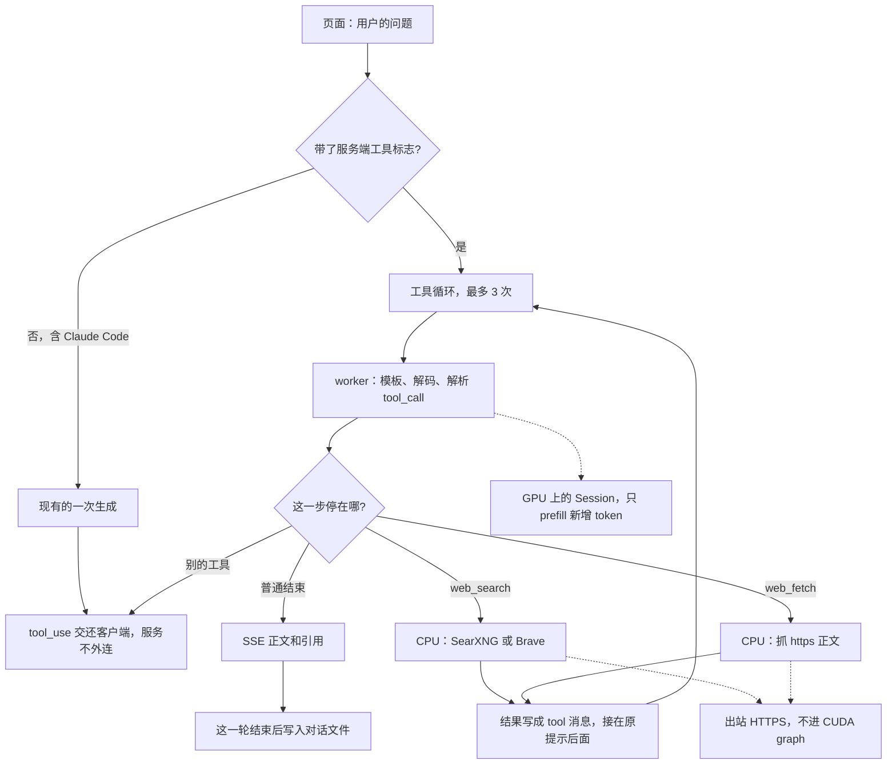

# 连网回答：方案

模型权重里没有「今天的新闻」。连网不是再训练，也不是给 GPU 开一个套接字。ChatGPT、Claude、Perplexity 做的是同一件事：模型在对话里发出一次工具调用，**进程外面**的程序去搜索或打开网页，把文字塞回对话，模型再写答案。本仓库的引擎已经能把工具调用从生成结果里解析出来，并把它交还给客户端。缺的是执行搜索的那一圈，以及网页这一轮不要在第一次工具调用处停住。

## 现在各家怎么做

三条产品线，一个循环。

| | 谁决定要不要搜 | 谁执行 | 答案里有什么 |
|---|---|---|---|
| ChatGPT 的搜索 | 模型调用内置的 `web_search`。心算、定义这类问题可以不搜 | OpenAI 的服务端，背后是搜索引擎，不是模型自己拉 TCP | 正文里的引用指向**这次真正返回的 URL** |
| Claude 的 `web_search` / `web_fetch` | 同样是模型调用服务端工具 | Anthropic 在这一次请求里跑完搜索和抓页，再让模型继续 | 响应里带搜索结果块和引用 |
| Perplexity 一类 | 默认就搜。先把问题改写成几条查询 | 检索、取回页面，再生成 | 句末编号，编号对应来源列表 |

Claude Code 走的是另一条，而且**这台服务已经支持**：模型停在 `tool_use`，客户端自己跑工具，再把 `tool_result` 放进下一轮请求。本机网页如果要像 ChatGPT 那样「问一句、出一段带出处的答案」，循环要放在服务里，不能要求浏览器去当 Claude Code。

开源里能对上的做法是：一个搜索 API（Brave、Tavily，或自己架的 SearXNG）加上按需抓取页面正文（Readability / trafilatura 一类抽取）。不抓 Google 的结果页。不引入一套 agent 框架，循环就是几十行。

## 这一次请求里发生什么



带标志的请求在服务里打转：生成在 GPU 上，搜索和抓页在 CPU 上，结果作为下一条消息再送回去。不带标志的请求走今天的路径，到一次 `tool_use` 就结束。

```text
页面                    服务                         搜索 API / 网页              GPU
 |  用户的问题            |                              |                         |
 |                       |-- 带上 web_search 的工具说明 --+------------------------>|
 |<-- 「正在搜索：…」 ----|<-- 模型写出一次 tool_call ----+-------------------------|
 |                       |-- query ---------------------->|                         |
 |                       |<-- 标题、URL、摘要 ------------|                         |
 |                       |   （可选）再抓 1～2 个页面正文                              |
 |                       |-- 把结果当成 tool 消息 --------+------------------------>|
 |<-- 正文，带引用 -------|<-- 模型根据结果写完 ----------+-------------------------|
 |  这一轮结束后写盘      |                              |                         |
```

每一圈只多出「工具说明 + 搜索结果」这些 token。`Session` 已经会接上一次的前缀，只 prefill 新增的部分。搜索发生在两次解码之间，在 CPU 上，不进 CUDA graph。

一轮里最多 **3 次**工具调用。用完还要再搜，就用已经拿到的材料写答案，并说明没查完。超时、空结果、页面抓失败，都写成工具结果里的一句错误，让模型自己说「没查到」，而不是由页面编一段。

## 已经有的

- `tokenrush/chat.py` 会渲染 Qwen 的工具说明，也会从 `<tool_call>` 里解析出函数名和参数。OpenAI / Anthropic 的工具协议在 `tokenrush/serve.py` 里能进能出。
- 模型见到工具调用就停，`stop_reason` 为 `tool_use`。Claude Code 靠这个工作。
- 前缀复用：下一轮消息是上一轮的延长时，KV 留着。

这些不动。Claude Code 继续自己执行它的 Bash / 编辑工具。服务端只自动执行我们自己的 `web_search` 和 `web_fetch`。跨对话回忆是同一套循环里的另一个工具，见 [memory.md](memory.md)。模型要是叫了一个别的工具，行为与现在相同：把调用交还给客户端，本机页面则显示「不会执行这个工具」。

## 还缺的

按这个顺序做。前两项就能回答「股价、今天的新闻」这一类问题；抓页是摘录质量，不是能不能连网。

### 1. 搜索后端

一个函数：`query -> [{title, url, snippet}]`，大约 5 条。

优先 **SearXNG**（自己的实例，内网机器只要能访问它）或 **Brave Search API**（一个 key，按次计费）。查询只发这一句 `query`，不把整段聊天记录交给搜索引擎。密钥放在环境变量里，不进仓库、不进对话文件。实现读 `SEARXNG_URL`（请求 `{url}/search?q=&format=json`）或 `BRAVE_API_KEY`。两个都没设时，工具结果是一句「没有配置搜索」，模型按没查到来回答。

这台机器必须能对外发 HTTPS。内网若拦住出站，代码写完也搜不到。

### 2. 服务端的工具循环

只在本机页面的请求上打开。页面在 `POST /v1/chat/completions` 里带上内置工具，并加一个标志表示「这些工具由服务执行」。没有这个标志时，`/v1/chat/completions` 保持今天的行为。

循环在现有 worker 外面：

1. 用现有的一次生成，直到 `end_turn` 或 `tool_use`。
2. `web_search`：执行搜索，把结果渲染成一条 `tool` 消息，追加到这次请求的消息列表，再生成。
3. 流里在两次生成之间插一条状态：正在搜索的那句 query。页面已经按 SSE 读增量，多认一种事件即可。
4. 三次之后强制收尾。

工具定义就一个参数：

```json
{"name": "web_search", "parameters": {"query": "string"}}
```

系统提示固定短的几句，放在该对话的 `system` 消息里，不写进权重：需要时效或你不确定的事实就搜索；只引用工具结果里出现过的 URL；搜不到就说搜不到。

### 3. 对话文件能记下工具回合

`tokenrush/chats.py` 现在只接受 `system` / `user` / `assistant`。跟进问题（「那第二条呢」）需要上次的搜索结果还在消息里，所以要多存两种：

| role | content |
|---|---|
| `assistant` | 正文；若这一步是工具调用，另存 `tool_calls`（名称和参数） |
| `tool` | 搜索结果的纯文本，带 `name` 和对应的调用 |

页面重载后，来源列表从这些消息还原，不靠浏览器内存。

### 4. 页面

生成时在助手气泡上方显示查询。结束后在气泡下给出这次用到的 URL，可点开。温度和思考开关不动。

### 5. 再抓页面正文

搜索摘要通常只有一两句。第二步再加 `web_fetch(url)`：只允许 `https`，拒绝内网地址和重定向到内网，限制体积（例如 1 MB）和抽取后的字数（例如 4000 字），超时几秒。模型自己决定要不要打开；一轮里最多打开 2 页。抽取用可读正文，丢掉导航和脚本。

## 不做的

- 不把搜索结果写进权重，也不为连网改 CUDA graph、草稿或量化。
- 不做约束解码。工具格式沿用现在的解析器。Qwen 的模板已经教过它怎么写 `<tool_call>`。解析失败就当作普通文本，这一轮不搜。
- 不默认每问必搜。Perplexity 那种「永远先检索」留到工具循环稳定之后再说。27B 在明确的工具说明下自己决定，够用。
- 不爬登录后的网页，不做浏览器自动化。

## 怎么算做完

用假的搜索服务测循环，不占 GPU：模型桩固定返回一次 `web_search`，假 HTTP 返回两条结果，第二轮生成引用了其中的 URL。断言 Claude Code 那种不带服务端标志的请求仍然停在 `tool_use`、不发起外连。

手工看三问：一个不该搜的（「2+2」），一个必须搜的（某天的公开价格或新闻），一个搜不到的。第三问的回答里应当出现没查到，而不是一个具体数字。
